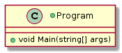
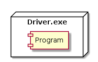

 

**CMPS 253 Software Engineering - Spring 2019-2020 \
Mahmoud Bdeir \
American University of Beirut**


## Lesson 1: Inline Logging (The Need for Reusability)


To provide logging functionality to your application, you might start by using inline calls to logging (like a simple `Console.Writeline()`, `print()`, `printf()`, etc.)

 
 ```c#
using System;
using System.Threading;
 
namespace Logger.Lesson1
{
    class Program
    {
        static void Main(string[] args)
        {
            Console.WriteLine($"{DateTime.Now} Program Started");
            Thread.Sleep(3000); //Simulating work by having the program sleep for 3 seconds
            Console.WriteLine($"Program Ended"); //programmer forgot to include time stamp
        }
    }
}
```

###### Class Diagram

###### Deployment Diagram



_____

 This solution is not optimal because you want the logging output to be standard: What if you forget to include a date/time stamp in one of your inline methods? Notice how the second call to logging does not output any timestamp.

<table style='width=100%;'>
<tr>
<td><a href="../../../../"> Back</a></td>
<td width="100%"></td>
<td><a href="../../../../tree/master/Lesson%2002%20Log%20Method"> Next</a></td>
</tr>
</table>
