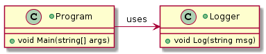
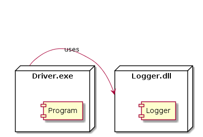

 

**CMPS 253 Software Engineering - Spring 2019-2020 \
Mahmoud Bdeir \
American University of Beirut**
 


## Lesson 4: Logger Library (Separation of Concerns)

<a href="./"> Source Code</a>

In order to be able to reuse the `Logger` class in other projects we would need to share its depoloyment unit `Driver.exe`. However, `Driver.exe` is not a library, it is a standalone console application which cannot be shared with other projects. In addition, the current `Driver.exe` has dual concerns: perform program logic, *and* log. This is does not comply with a design principle called *Separation of Concerns* or SoC. 

> Separation of Concerns or SoC per **Dijkstra**: Let me try to explain to you, what to my taste is characteristic for all intelligent thinking. It is, that one is willing to study in depth an aspect of one's subject matter in isolation for the sake of its own consistency, all the time knowing that one is occupying oneself only with one of the aspects... It is what I sometimes have called “the separation of concerns”, which, even if not perfectly possible, is yet the only available technique for effective ordering of one's thoughts, that I know of. 

The sensible solution thus, is be to move `Logger` to its own library. 


```C#
using System;
namespace Logger.Solution4
{
    public class Logger
    {
        public static void Log(string msg)
        {
            Console.WriteLine($"{DateTime.Now} {msg}");
        }
    }
}
```

```C#
using System;
using System.Threading;
namespace Logger.Solution4
{
    class Program
    {
        static void Main(string[] args) //send email to all students
        {
            Logger.Log("Program Started");
            Thread.Sleep(3000); //Simulating work by having the progr
            Logger.Log("Program Ended");
        }
    }
}
```


###### Class Diagram

###### Deployment Diagram


_____

 Now we have two binary deployment units (`Driver.exe` and `Logger.dll`) each of them has a single concern.


<table style='width=100%;'>
<tr>
<td><a href="../../../../tree/master/Lesson%2003%20Logger%20Class"> Back</a></td>
<td width="100%"></td>
<td><a href="../../../../tree/master/Lesson%2005%20Log%20To%20File/Solution%200%20LogToFile%20Method/Source%20Code"> Next</a></td>
</tr>
</table>
