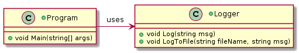
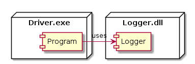

 

**CMPS 253 Software Engineering - Spring 2019-2020 \
Mahmoud Bdeir \
American University of Beirut**


## Lesson 5.0: LogToFile Method (Adding a Responsiblity: Anti-pattern)
<a href="./"> Source Code</a>

#### User Story 1: Log to File
*US1*: As a programmer, I would like to log to a file, so I can analyze it in detail at a later time.


##### Solution 0: Add to the `Logger` class a method `LogToFile` that logs to a file

```C#
using System;
using System.IO;
namespace Lesson5.Solution0
{
    public class Logger
    {
        public static void Log(string msg)
        {
            Console.WriteLine($"{DateTime.Now} {msg}");
        }
        public static void LogToFile(string fileName, string msg)
        {
            File.AppendAllText(fileName, $"{DateTime.Now} {msg}\n");
        }
    }
}
```

```C#
using System.Threading;

namespace Lesson5.Solution0
{
    class Program
    {
        static void Main(string[] args)
        {
            Logger.Log("Program Started");
            Logger.LogToFile(".\\log.txt","Program Started");
			
            Thread.Sleep(3000); //Simulating work by having the program sleep for 3 seconds
			
            Logger.Log("Program Ended");
            Logger.LogToFile(".\\log.txt", "Program Ended");
        }
    }
}
```

###### Class Diagram

###### Deployment Diagram


_____

 This is a bad solution because it does not comply with SRP as now this class has dual responsibilities: logging to console and logging to a file.

A better approach would be to create a class whose sole responsibility is to log to a file _(achieving SRP)_.


<table style='width=100%;'>
<tr>
<td><a href="../../../Lesson%2004%20Logger%20Library/Source%20Code/"> Back</a></td>
<td width="100%"></td>
<td><a href="../../Solution%201%20FileLogger%20Class/Source%20Code/"> Next</a></td>
</tr>
</table>
