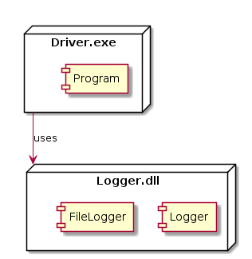

 

**CMPS 253 Software Engineering - Spring 2019-2020 \
Mahmoud Bdeir \
American University of Beirut**


## Lesson 5.1: FileLogger Class (SRP again)
<a href="./"> Source Code</a>

#### User Story 1: Log to File
*US1*: As a programmer, I would like to log to a file, so I can analyze it in detail at a later time.
A better approach would be to create a class whose sole responsibility is to log to a file _(achieving SRP)_.


##### Solution 1: A better solution would be to add a class whose sole responsibility is to log to a file.


```C#
using System;
using System.IO;

namespace Lesson5.Solution1
{
    public static class FileLogger
    {
        public static void LogToFile(string fileName, string msg)
        {
            File.AppendAllText(fileName, $"{DateTime.Now} {msg}\n");
        }
    }
}
```

```C#
using System;

namespace Lesson5.Solution1
{
    public static class Logger
    {
        public static void Log(string msg)
        {
            Console.WriteLine($"{DateTime.Now} {msg}");
        }
    }
}
```


_____

###### Class Diagram

###### Deployment Diagram


 Although this solution complies with the SRP design principle, it does not comply with the Separation of Concerns design principle as now we have one library `Logger.dll` that has dual concerns: logging to console and logging to a file.


<table style='width=100%;'>
<tr>
<td><a href="../../../Lesson%2005%20Log%20To%20File/Solution%200%20LogToFile%20Method/Source%20Code/"> Back</a></td>
<td width="100%"></td>
<td><a href="../../../Lesson%2005%20Log%20To%20File/Solution%202%20FileLogger%20Library/Source%20Code"> Next</a></td>
</tr>
</table>
