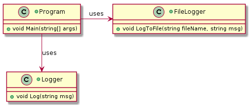
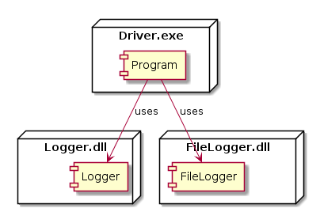

 

**CMPS 253 Software Engineering - Spring 2019-2020 \
Mahmoud Bdeir \
American University of Beirut**

## Lesson 5.2: FileLogger Library (Separation of Concerns)
<a href="./"> Source Code</a>

#### User Story 1: Log to File
*US1*: As a programmer, I would like to log to a file, so I can analyze it in detail at a later time.

 Although the preceding solution complies with the SRP design principle, it does not comply with the *Separation of Concerns* design principle as now we have one library `Logger.dll` that has dual concerns: logging to console and logging to a file.

> Separation of Concerns or SoC per **Dijkstra**: Let me try to explain to you, what to my taste is characteristic for all intelligent thinking. It is, that one is willing to study in depth an aspect of one's subject matter in isolation for the sake of its own consistency, all the time knowing that one is occupying oneself only with one of the aspects... It is what I sometimes have called “the separation of concerns”, which, even if not perfectly possible, is yet the only available technique for effective ordering of one's thoughts, that I know of. 

One way to think about SoC is that it encourages decoupling of software components. In this example, `FileLogger` and `Logger` are coupled together in one library for no reason. If we need to make a change to one, the other might be inadvertently affected. 

 A better solution would be to add a new library that houses the `FileLogger` class.

____

Note that there is no need to change any code (same class diagram), we only need to move the `FileLogger` class to a new Library.

###### Class Diagram

###### Deployment Diagram

____

<table style='width=100%;'>
<tr>
<td><a href="../../Solution%201%20FileLogger%20Class/Source%20Code/"> Back</a></td>
<td width="100%"></td>
<td><a href="../Lesson%2006/Driver/README.md"> Next</a></td>
</tr>
</table>

