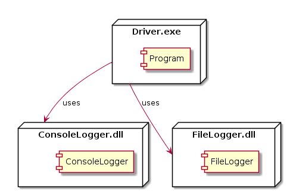

 

**CMPS 253 Software Engineering - Spring 2019-2020 \
American University of Beirut \
Mahmoud Bdeir**


## Lesson 6.0: Log Method (Abstraction Through Methods)

#### User Story 2: Multiple Output Logging
*US2*: As a programmer, I would like to log to a both file and console at the same time.

A solution would be to use a method to do the logging to both File and Consle. This way you guarantee uniform log output (for example: time followed by message) and we achieve Reusability.
> Software Reusability is an attribute that refers to the expected reuse potential of a software component. Software reuse not only improves productivity but also has a positive impact on the quality and maintainability of software products.

```C#
using System.Threading;

namespace Lesson6.Solution0
{
    class Program
    {
        static void Main(string[] args)
        {
            Log(".\\log.txt","Program Started");
            
            Thread.Sleep(3000); //Simulating work by having the program sleep for 3 seconds

            FileLogger.Log(".\\log.txt", "Program Ended");
        }

        static void Log(string msg, string fileName)
        {
            ConsoleLogger.Log(msg);
            FileLogger.Log(fileName, msg);
        }
    }
}
```

###### Class Diagram

###### Deployment Diagram


____
 You can use this method in the `Program` class only. How do you share it with other classes? Making the method public allows other classes to call on this method. However, doing so would defeat SRP:
> Single Responsibility Principle or SRP: A class should have one, and only one, reason to change.

<table style='width=100%;'>
<tr>
<td><a href="../../../Lesson%2005%20Log%20To%20File/Solution%202%20Refactored/Source%20Code"> Back</a></td>
<td width="100%"></td>
<td><a href="../../Solution%201%20MultiLogger%20Class%20and%20Library/Source%20Code"> Next</a></td>
</tr>
</table>
