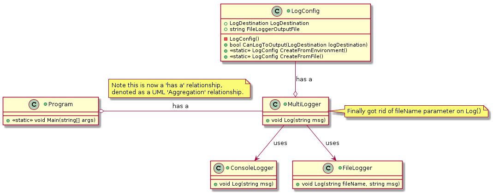

 

**CMPS 253 Software Engineering - Spring 2019-2020 \
American University of Beirut \
Mahmoud Bdeir**


## Lesson 7.1: Configuration Files

#### User Story 3: Multiple Output Logging
*US3*: As a user of a software that uses Logger, I would like to output to multiple targets *(File, Console, etc.)* when I run the program.

Sometimes the configuration info needed by a class or component --in this case the `AllLogger` class-- is too complicated to be passed-in as a command-line argument, and, more importantly, the user may override these changes as a set of preferences at runtime. In cases like that, a command-line argument is not an option. Instead, we use configuration files.


> From [Wikipedia](https://en.wikipedia.org/wiki/Configuration_file): In computing, configuration files (commonly known simply as config files) are files used to configure the parameters and initial settings for some computer programs. They are used for user applications, server processes and operating system settings. Some applications provide tools to create, modify, and verify the syntax of their configuration files; these sometimes have graphical interfaces. For other programs, system administrators may be expected to create and modify files by hand using a text editor; possible because many are human-editable plain text files. For server processes and operating-system settings, there is often no standard tool, but operating systems may provide their own graphical interfaces such as YaST or debconf.

For example, if you use VSCode as a code editor, you are probably familiar with the `settings.json` where you set your preferences. Each time you start VSCode, this file is read and the configuration is established.

**Common Configuration File Formats:**
* [INI](https://docs.python.org/3/library/configparser.html) file, a common configuration file format
* [.properties](https://mkyong.com/java/java-properties-file-examples/), a file extension mainly used in Java
* [JSON](https://www.json.org/json-en.html), with support for complex data types and data structures
* [YAML](https://yaml.org/start.html), with support for complex data types and structures


##### Solution 1: AllLogger Configuration Through A Configuration File
An advantage of using a configuration file is that, finally, we do no longer need to pass the log filename as a parameter to `AllLogger.Log`. We were passing that parameter even when only console logging was required.

```
#log.config
targets=fc
FileLoggerFile=log.txt
```

```C#
using System;

namespace MultiLogger
{

    [Flags]
    public enum LogDestination
    {
        None=0,
        Console=1,
        File=2,
        Both=4,
    }
}
```

```C#
using System.IO;
using System.Linq;
namespace Lesson7.Solution1
{
    public class LogConfig
    {
        public LogDestination LogDestination { get; } = LogDestination.None; //read-only property, also initialized to a value. Thank you C#..
        public bool CanLogToOutput(LogDestination logDestination) => ((LogDestination & logDestination) == logDestination);
        public string FileLoggerOutputFile { get; }
        public LogConfig()
        {
            const string LogFile = ".//log.config";
            const string DefaultTargetsLine = @"\ntargets=fc\n";
            const string DefaultFileLoggerFile= "log.txt";

            //programming pleasantness
            //if no config file exists, then create one
            if (!File.Exists(LogFile))
            {
                File.AppendAllText(LogFile, DefaultTargetsLine);
            }

            //if the config file does not have an entry for targets, then add one
            string TargetConfigLine = File.ReadAllLines(LogFile).SingleOrDefault(p=>p.ToLower().StartsWith("targets="));
            if (TargetConfigLine == null) 
            {
                File.AppendAllText(LogFile, DefaultTargetsLine);
                TargetConfigLine = DefaultTargetsLine;
            }

            //if the config file does not have an entry for file logger file, then add one
            string FileLoggerFile = File.ReadAllLines(LogFile).SingleOrDefault(p=>p.ToLower().StartsWith("fileloggerfile="));
            if (FileLoggerFile == null)
            {
                File.AppendAllText(LogFile, DefaultFileLoggerFile);
                FileLoggerFile = DefaultTargetsLine;
            }

            //determine what which target(s) to output to
            string targets = TargetConfigLine.Split('=')[1].ToUpper();
            if (targets.Contains('C'))
            {
                LogDestination |= LogDestination.Console;
            }
            if (targets.Contains('F'))
            {
                LogDestination |= LogDestination.File;
            }
        }
    }
}
```

```C#
namespace Lesson7.Solution1
{
    public class MultiLogger
    {
        private LogConfig Configuration;
        public MultiLogger()
        {
            Configuration = new LogConfig();
        }
        public void Log(string msg)
        {
            if (Configuration.CanLogToOutput(LogDestination.Console))
            {
                ConsoleLogger.Log(msg);
            }
            if (Configuration.CanLogToOutput(LogDestination.File))
            {
                FileLogger.Log(Configuration.FileLoggerOutputFile, msg);
            }
        }
    }
}
```

```C#
using System.Threading;

namespace Lesson7.Solution1
{
    class Program
    {
        static void Main(string[] args)
        {
            MultiLogger logger = new MultiLogger();

            //Ready to start logging
            logger.Log("Program Started"); //finally got rid of the pesky file name parameter for logging to file

            Thread.Sleep(3000); //Simulating work by having the program sleep for 3 seconds

            logger.Log("Program Ended"); //finally got rid of the pesky file name parameter for logging to file
        }
    }
}
```

Now we can run the program from command-line, and if no config file is present, a default one will be created:
```
driver.exe
```
_____

###### Class Diagram

###### Deployment Diagram


____

<table style='width=100%;'>
<tr>
<td><a href="../../Solution%200%20Command-Line%20Argument/Source%20Code"> Back</a></td>
<td width="100%"></td>
<td><a href="../../Solution%202%20Environment%20Variables/Source%20Code"> Next</a></td>
</tr>
</table>
