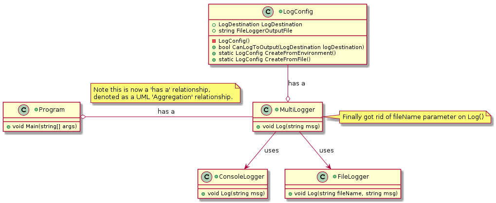
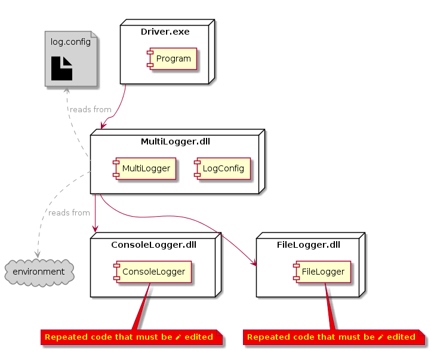

 

**CMPS 253 Software Engineering - Spring 2019-2020 \
American University of Beirut \
Mahmoud Bdeir**


## Lesson 8: Uniform Log Output Formatting

There is a subtle but important design flaw in what we did so far: if the programmer is asked to change the outpout format

Sometimes configuration info needed by a class or component --in this case the `AllLogger` class-- is too sensitive to be stored as plain text in a configuration file. In cases like that, a configuration file is either encrypted or not used at all. Instead, we use environment variables to pass configuration data to a class/component. Operating systems, use configuration files heavily.


> From [Wikipedia](https://en.wikipedia.org/wiki/Environment_variable): An environment variable is a dynamic-named value that can affect the way running processes will behave on a computer. They are part of the environment in which a process runs. For example, a running process can query the value of the TEMP environment variable to discover a suitable location to store temporary files, or the HOME or USERPROFILE variable to find the directory structure owned by the user running the process. They were introduced in their modern form in 1979 with Version 7 Unix *(predecessor of Linux)*.

For example, if you type `notepad.exe` or simply `notepad` on a command prompt under Windows you'll notice the launch of the notepad application. That is because the terminal (the shell to be more precise) was able to find the program/command you called for (notepad). The reason it did is the `PATH` environment variable. Simply type `path` on a command line, and you'll get a list of all variables defined for that instance of the shell. Notice the presence of a variable called `path` and a value of `c:\windows;`. In a nutshell, when you type a command in a terminal window, Windows will look in all directories specified by the `PATH` environment variable to find that command --in the order in which they are listed.


**To set an environment variable:** 
* Windows follow this [link](https://www.techjunkie.com/environment-variables-windows-10/)
* Mac OS follow this [link](https://medium.com/@youngstone89/setting-up-environment-variables-in-mac-os-28e5941c771c)
* Ubuntu follow this [link](https://mkyong.com/linux/how-to-set-environment-variable-in-ubuntu/)

##### Solution 2: AllLogger Configuration Through Environment Variables
Similar to Configuration Files, an advantage of using a environment variables is that, finally, we do no longer need to pass the log filename as a parameter to `AllLogger.Log`. We were passing that parameter even when only console logging was required.

```
#environment variables
targets=fc
FileLoggerFile=log.txt
```

```C#
using System;

namespace Lesson7.Solution2
{

    [Flags]
    public enum LogDestination
    {
        None=0,
        Console=1,
        File=2,
        Both=4,
    }
}
```

```C#
using System;
using System.IO;
using System.Linq;
namespace Lesson7.Solution2
{
    public class LogConfig
    {
        private const string LogFile = ".//log.config";
        private const string DefaultTargetsLine = @"\ntargets=fc\n";
        private const string DefaultFileLoggerFile= "log.txt";

        public LogDestination LogDestination { get; private set; } = LogDestination.None; //read-only property, also initialized to a value. Thank you C#..
        public string FileLoggerOutputFile { get; private set; }
        public bool CanLogToOutput(LogDestination logDestination) => ((LogDestination & logDestination) == logDestination);
        private LogConfig() { }
        public static LogConfig CreateFromEnvironment()
        {
            LogConfig logConfig = new LogConfig();

            //if the environment does not have an entry for targets, then use a default
            string targets = Environment.GetEnvironmentVariable("targets");
            if (targets == null)
            {
                targets = DefaultTargetsLine.ToUpper();
            }

            //determine what which target(s) to output to
            if (targets.Contains('C'))
            {
                logConfig.LogDestination |= LogDestination.Console;
            }
            if (targets.Contains('F'))
            {
                logConfig.LogDestination |= LogDestination.File;
            }

            //if the environment does not have an entry for file logger file, then use a default
            string FileLoggerFile = Environment.GetEnvironmentVariable("fileloggerfile");
            if (FileLoggerFile == null)
            {
                FileLoggerFile = DefaultFileLoggerFile;
                File.AppendAllText(LogFile, FileLoggerFile);
            }
            logConfig.FileLoggerOutputFile = FileLoggerFile;

            return logConfig;
        }

        public static LogConfig CreateFromFile()
        {
            LogConfig logConfig = new LogConfig();

            //programming pleasantness
            //if no config file exists, then create one
            if (!File.Exists(LogFile))
            {
                File.AppendAllText(LogFile, DefaultTargetsLine);
            }

            //if the config file does not have an entry for targets, then add one
            string TargetConfigLine = File.ReadAllLines(LogFile).SingleOrDefault(p=>p.ToLower().StartsWith("targets="));
            if (TargetConfigLine == null) 
            {
                File.AppendAllText(LogFile, DefaultTargetsLine);
                TargetConfigLine = DefaultTargetsLine;
            }

            //determine what which target(s) to output to
            string targets = TargetConfigLine.Split('=')[1].ToUpper();
            if (targets.Contains('C'))
            {
                logConfig.LogDestination |= LogDestination.Console;
            }
            if (targets.Contains('F'))
            {
                logConfig.LogDestination |= LogDestination.File;
            }

            //if the config file does not have an entry for file logger file, then add one
            string FileLoggerFile = File.ReadAllLines(LogFile).SingleOrDefault(p=>p.ToLower().StartsWith("fileloggerfile="));
            if (FileLoggerFile == null)
            {
                FileLoggerFile = DefaultFileLoggerFile;
                File.AppendAllText(LogFile, FileLoggerFile);
            }
            logConfig.FileLoggerOutputFile = FileLoggerFile;
          
            return logConfig;
        }
    }
}

```
\
\
 Notice that in `AllLogConfig` the default constructor is made private, and two static methods `CreateFromEnvironment` and `CreateFromFile` are provided to create an instance of the class using either a config file or environment variables respectively. Using constructors in this case is not possible without adding some artificial parameters to the constructors to differentiate needing to configure the created object from a config file or from environment variables.

 Note the *programming pleasantness* provided by the `LogConfig` file:
* If the config file is not present, a default one is created, making it easier for the end-user to edit preferences as the user does not know the expected format.
* If environment variables are not present, instead of crashing, the program uses default values and continue operating.
```C#
namespace Lesson7.Solution2
{
    public class MultiLogger
    {
        private LogConfig Configuration;
        public MultiLogger(LogConfig logConfig)
        {
            this.Configuration = logConfig;
        }
        public void Log(string msg)
        {
            if (Configuration.CanLogToOutput(LogDestination.Console))
            {
                ConsoleLogger.Log(msg);
            }
            if (Configuration.CanLogToOutput(LogDestination.File))
            {
                FileLogger.Log(Configuration.FileLoggerOutputFile, msg);
            }
        }
    }
}
```
 `MultiLogger` now requires a `LogConfig` as a parameter to its only constructor, forcing the user to pass one. 

```C#
using System.Threading;

namespace Lesson7.Solution2
{
    class Program
    {
        static void Main(string[] args)
        {
            MultiLogger logger = new MultiLogger(LogConfig.CreateFromFile());

            //Ready to start logging
            logger.Log("Program Started"); //finally got rid of the pesky file name parameter for logging to file

            Thread.Sleep(3000); //Simulating work by having the program sleep for 3 seconds

            logger.Log("Program Ended"); //finally got rid of the pesky file name parameter for logging to file
        }
    }
}
```
 Finally, it is the driver program that decides whether it wants to create a configuration to pass to `MultiLogger` from file or from environment variable. This is useful for the programmer developing the software, instead of having to restart the IDE each time a new environment varible is added (for it to take effect if the program is launched from the IDE), the programmer may decide to use the file configuration instead. Before deploying, the programmer changes the creation of a `LogConfig` to come from a config file.

Now we can run the program from command-line, and if the requested environment variables are not present, default values will be used:
```
driver.exe
```
_____

###### Class Diagram

###### Deployment Diagram


____

<table style='width=100%;'>
<tr>
<td><a href="../../Lesson%2007%20Dynamic%20Log%20Output/Solution%202%20Environment%20Variables/Source%20Code"> Back</a></td>
<td width="100%"></td>
<td><a href="../../tree/master/Lesson%2003%20Logger%20Class"> Next</a></td>
</tr>
</table>
